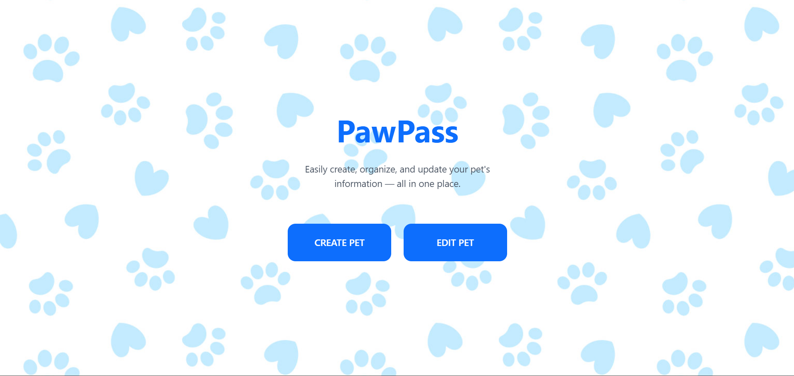

# PawPass

Quickly and efficiently store, update, access information about your pets in one place. This webapp is both compatible with desktop and mobile.

## Links
[Link to website](https://paw-pass.vercel.app/)

[Link to sample pet display](https://paw-pass.vercel.app/pet?id=246)

[Link to demo video](https://youtu.be/Tc7hlbFZN98)

## How to Use
When you first open the website, you have the option to create a new pet or edit an existing pet.

1. Create your pet with the Create Pet button. Then input the information of your, the fields marked with a (*) are required. Be sure to also set and remember your password so you can edit your pet information when needed.
2. Edit any information about your pet by clicking on the Edit Pet button. Input your password and pet ID, then change any information from there. The information will automatically update on your pet's display page. Your QR code will also be shown again in case you need to access it.

After creating or editing your pet, a QR code will automatically generate. You can scan this QR code with any device, or go to the link given, it will take you to a webpage where all of your pet's information will be displayed. Make sure to also take note of your pet's ID for when you need to edit your pet's information.

To view your pet's information, scan the given QR code or go to the link displayed below the QR code on the finish creating pet screen.

## Purpose and Use

### Who Can Use It

We built this app for pet shelters and individuals to keep track of their pets. Individuals might utilize this by attaching their pet's QR code on the collar, so if the pet gets lost, all necessary and vital information is there for whoever finds the pet. Pet shelters might also use this app to keep track and access information of their pets instantly.

### Why It Was Made

We made this after consulting with pet shelters volunteers about what they wish they could improve the most. They informed us they would love a system in which they can scan a QR code and it will pull up all the information about a pet. So, we expanded on that, and created a system that can be used both by shelters and owners.

## How it Was Made
This website was originally made by Thuc Chi Do ([thucchi-cs](https://github.com/thucchi-cs)) and Ronin Gambill ([Ronin-the-Barbarian](https://github.com/Ronin-the-Barbarian)).

We used `Python` with `Flask` and `Jinja`. We also used `JavaScript`, `HTML`, and `Tailwind CSS`. We connected our app to an external database on `Supabase`. The app is deployed on the web using `Vercel`.

When building this app, we had trouble generating and displaying the QR code. We originally had it so the app would save the QR code to our filesystem and display that PNG file. But with our set up, we couldn't save the image. Instead, we found a way to save the image using temporary memory spaces. This way, we could display and offer users the option to save the image.